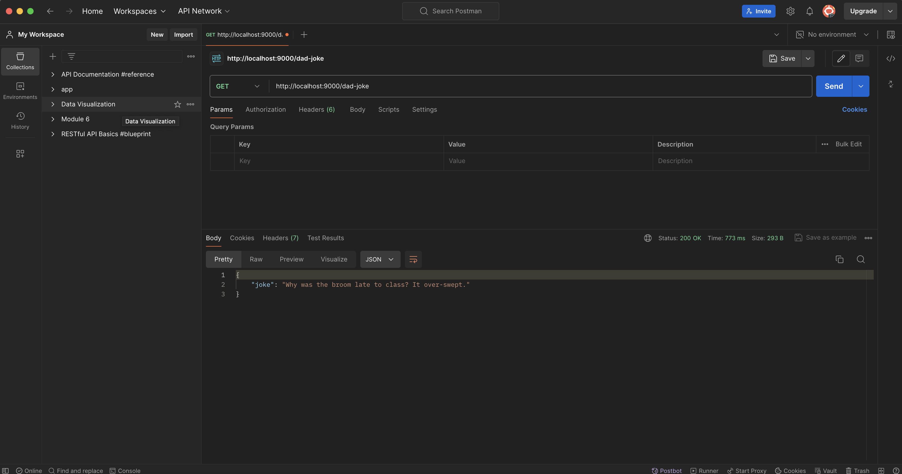

# Random Joke API

This is a simple Node.js application that serves random dad jokes using the [API Ninja](https://api-ninjas.com/api/dadjokes) service. It uses Express for handling HTTP requests and Axios for making API calls.

## Screenshort


## Features

- Fetch a random dad joke
- Handle 404 errors for undefined routes

## Prerequisites

- Node.js (v12 or higher)
- npm (v6 or higher)

## Installation

1. Clone the repository:

    ```sh
    git clone https://github.com/Lovenoelkujur/randomjoke-api.git
    cd random-joke-api
    ```

2. Install the dependencies:

    ```sh
    npm install
    ```

3. Create a `.env` file in the root of the project and add your API keys:

    ```sh
    API_NINJA_X_API_KEY=your_api_ninja_x_api_key
    ```

## Usage

1. Start the server:

    ```sh
    npm start
    ```

2. The server will be running on port 9000. You can access the random dad joke endpoint at:

    ```sh
    http://localhost:9000/dad-joke
    ```

## API Endpoints

### GET /dad-joke

Fetch a random dad joke.

**Response:**

- `200 OK` on success
  ```json
  {
    "joke": "Your dad joke here"
  }

- `500 Internal Server Error` on failure
  ```json
  {
     "error": "Internal server error occured"
  }

- 404 Not Found
  ```json
  {
    "message": "PAGE NOT FOUND"
  } 

## Environment Variables

- `API_NINJA_X_API_KEY`: Your API Ninja X API key

## Dependencies
- dotenv : Loads environment variables from a `.env` file into `process.env`. 

- express: Fast, unopinionated, minimalist web framework for Node.js.

- axios: Promise based HTTP client for the browser and node.js.

```perl

Make sure to replace `yourusername` in the clone URL with your actual GitHub username if you plan to use the URL provided. Also, ensure you have your API keys ready and properly set in the `.env` file.
```

## License
This project is licensed under the MIT License.
